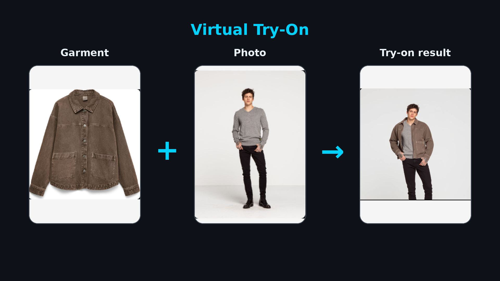

<p align="center">
  
</p>

# Galaxus Virtual Try-On

Virtual try-on for Galaxus storefronts, in two parts:

| Folder | What it is |
| ------ | ---------- |
| [`api/`](./api) | An ASP.NET Core (.NET 10) Web API wrapping the [Black Forest Labs](https://docs.bfl.ml) **FLUX Virtual Try-On** endpoint. |
| [`chrome-extension/`](./chrome-extension) | A Manifest V3 Chrome extension with a side-panel UI that works on all Galaxus domains, calling the API. |

The API handles BFL's asynchronous workflow for you (submit → poll), supports image inputs
as **URLs, base64, or file uploads**, and ships with OpenAPI docs and a small browser demo
"fitting room". The extension auto-detects the product image on a Galaxus page (the garment)
and lets you drop your photo to generate a try-on. See
[`chrome-extension/README.md`](./chrome-extension/README.md) for that part.

- **Region:** the API always uses BFL's **EU** endpoint (`api.eu.bfl.ai`) for low latency.
- **Auth:** the API is **public** — no authentication is required to call it, and CORS is
  open to any origin. Only the server-side BFL API key is secret.

---

# API (`api/`)

## Project layout

```
api/
├── Program.cs                     # DI wiring, OpenAPI, Scalar, CORS, static files, exception handler
├── Configuration/BflOptions.cs    # API key, EU host, polling settings (bound from "Bfl" section)
├── Models/
│   ├── Bfl/                       # BFL wire models (submit payload/response, poll response)
│   ├── VtoApiModels.cs            # this API's request/response DTOs
│   └── VtoStatus.cs               # status helpers + default prompt
├── Services/
│   ├── IBflVtoClient.cs / BflVtoClient.cs   # typed HttpClient: submit, poll, wait
│   ├── BflVtoException.cs                    # structured upstream error
│   └── BflExceptionHandler.cs               # maps errors to RFC 7807 problem responses
├── Endpoints/VtoEndpoints.cs      # the /api/vto routes
└── wwwroot/index.html             # demo fitting-room page (served at /)
```

## Configuration

Settings live under the `Bfl` section of `appsettings.json`. The **API key** is read from
(in order) `Bfl:ApiKey` config (user-secrets) or the `BFL_API_KEY` environment variable —
it is **not** committed to source.

The key has already been stored in this project's user-secrets store:

```bash
dotnet user-secrets set "Bfl:ApiKey" "<your-key>" --project api
```

Or, for production, set an environment variable instead:

```bash
# PowerShell
$env:BFL_API_KEY = "<your-key>"
```

## Run

```bash
dotnet run --project api
```

Then open:

- `http://localhost:5056/` — demo fitting-room page
- `http://localhost:5056/scalar/v1` — interactive API reference (Development only)
- `http://localhost:5056/health` — health + whether the key is configured

To use the **Chrome extension** against this API, start it as above and follow
[`chrome-extension/README.md`](./chrome-extension/README.md).

## Endpoints

| Method | Route | Description |
| ------ | ----- | ----------- |
| `POST` | `/api/vto` | Submit a job (images as URL or base64). Returns `202` with the task id + polling info. |
| `POST` | `/api/vto/upload` | Submit a job by uploading `person` + `garment` files (multipart). Add `?wait=true` to block until the result is ready. |
| `POST` | `/api/vto/try-on` | Submit **and wait** for the result image (synchronous convenience). |
| `GET`  | `/api/vto/{id}` | Poll a job by id. |

### Request fields (JSON)

| Field | Type | Required | Notes |
| ----- | ---- | -------- | ----- |
| `person` | string | yes | Person image — URL or base64 |
| `garment` | string | yes | Garment reference — URL or base64 |
| `prompt` | string | no | Defaults to a sensible try-on prompt |
| `seed` | int | no | Reproducibility |
| `safetyTolerance` | int (0–5) | no | Moderation strictness (BFL default 2) |
| `outputFormat` | string | no | `jpeg` (default), `png`, `webp` |
| `webhookUrl` / `webhookSecret` | string | no | Async callback |

### Examples

Synchronous (returns the final image URL):

```bash
curl -X POST http://localhost:5056/api/vto/try-on \
  -H "Content-Type: application/json" \
  -d '{
        "prompt": "The person of image 1, maintaining exactly their face and pose, wearing the olive green bomber jacket of image 2.",
        "person": "https://.../person.png",
        "garment": "https://.../garment.png",
        "outputFormat": "webp"
      }'
# -> { "id": "...", "status": "Ready", "imageUrl": "https://delivery.../sample.webp", "seed": ... }
```

Upload files and wait:

```bash
curl -X POST "http://localhost:5056/api/vto/upload?wait=true" \
  -F person=@person.png \
  -F garment=@garment.png \
  -F prompt="The person of image 1, maintaining exactly their face and pose, wearing the garments of image 2." \
  -F outputFormat=webp
```

Async submit + poll:

```bash
curl -X POST http://localhost:5056/api/vto \
  -H "Content-Type: application/json" \
  -d '{ "person": "https://.../person.png", "garment": "https://.../garment.png" }'
# -> 202 { "id": "...", "pollingUrl": "...", "statusUrl": "/api/vto/..." }

curl "http://localhost:5056/api/vto/<id>"
# -> { "status": "Pending" | "Ready", "imageUrl": "..." }
```

## Prompting tips (from the BFL docs)

Core formula:

> `The person of image 1, maintaining exactly their face and pose, wearing the {GARMENT DESCRIPTIONS} of image 2.`

A concise garment description (fit + category, e.g. *the oversized tee*, *the 7/8 length pants*)
noticeably improves quality. For multi-garment outfits, merge garments onto a single canvas
and send that as the `garment` image. Keep inputs around ~1 megapixel for best latency.

> **Note:** Signed result (`imageUrl`) URLs are only valid for ~10 minutes — download promptly.

## Notes

- The synchronous flow polls every `Bfl:PollIntervalMs` (1s) up to `Bfl:PollTimeoutSeconds`
  (120s); on timeout it returns `504` but the job may still finish — poll it by id.
- Errors are returned as RFC 7807 problem responses: `404` (task not found),
  `422` (content moderated), `502`/`504` (upstream failures), `400` (validation).
